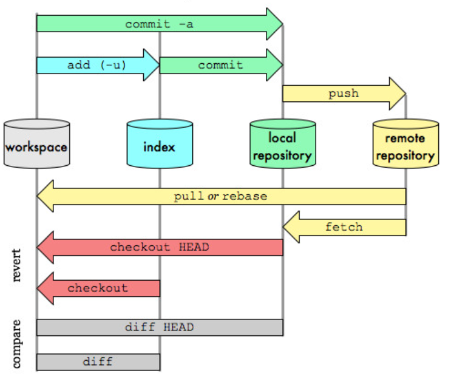

Перше налаштування Git
----------------------

.. glossary:: 

    ``config``
        * ``--system -l`` - конфігурація для всіх користувачів c:/Program Files/Git/etc/gitconfig
        * ``--global -l`` - конфігурація для користувача [user]/.gitconfig
        * ``--local -l`` - конфігурація для репозиторія .git/config
        * ``--global user.name "..."`` - ім'я користувача
        * ``--global user.email ...`` - e-mail
        * ``user.name "..."`` - ім'я користувача для проекта
        * ``user.email ...`` - e-mail для проекта
        * ``--global alias.<shortname> '<command'`` - введення псевдоніму команді

Отримання довідки
-----------------------

.. glossary:: 

    ``help``
        ``<command>`` - онлайн довідка
    
    ``<command> -h``
        коротка довідка
        
Як працює Git
----------------

.. glossary::

    ``git workflow``
        * Створіть repository (проект) за допомогою інструменту new сайті github
        * Скопіюйте (clone) репозиторій на вашу локальну машину
        * Додайте файл до свого локального репо та commit (збережіть) зміни
        * Push ваші зміни до основної гілки віддаленого сховища
        * Внесіть зміни у свій файл за допомогою інструмента хостингу git і commit
        * Pull зміни на вашу локальну машину
        * Створіть гілку (версію), внесіть зміни, commit зміни
        * Відкрити pull request (запропонувати зміни до головної гілки)
        * Merge свою гілку з головною гілкою

Клонування репозиторію
-------------------------

.. glossary::

    ``clone``
        * https://github.com/<repo> - копіювання існуючого github repo
        * ``<local path>`` - копіювання з локального сховища
        * ``--single-branch`` - rлонувати лише одну гілку, на яку вказує HEAD або ``--branch``
        * ``-b`` - rлонувати віддалену гілку замість HEAD

Створення репозиторію з існуючого каталогу
------------------------------------------

.. glossary::

    ``init``
        * розпочинає використовувати з цим проектом Git

Відстеження нових файлів
-----------------------------

.. glossary::

    ``add``
        * <file> - розпочати відстеження нового файлу        

Запис змін до репозиторію
-----------------------------------

.. glossary::

    ``commit`` 
        * ``-m "commit message"`` - dнести зміни
        * ``<file>`` - внести зміни до файлу
        * ``--amend`` - замінює попередній комміт поточним індексом
        * ``-a -m "message"`` - внести зміни з попереднім додаванням в індекс

Опублікування змін
-----------------------

.. glossary::

    ``push``
        * ``origin master`` - надсилає головну гілку на віддалений репозиторій
        * ``--all,  --branches`` - надсилає всі гілки на віддалений репозиторій
        * ``<remote_name> -d, --delete <remote_branch-name>`` - видалення віддалених гілок
        * ``origin <tagname>`` - надсилає тег на віддалений репозиторій
        * ``origin --tags`` - надсилає всі тегі на віддалений репозиторій
        * ``origin --delete <tagname>`` - видаляє тег з віддаленого репозиторію
        
Перенесення змін на локальний репозиторій
---------------------------------------------

.. glossary::

    ``fetch``
        ``origin`` - забирає посилання на всі дані віддаленого сховища

    ``pull``
        отримати та об’єднати віддалену гілку з поточною гілкою

Створення нової гілки (версії)
----------------------------------

.. glossary::

    ``branch``
        * виводить список локальних гілок
        * ``<branch name>`` - створює новий ``HEAD`` на поточний комміт, але не переключилися на нього
        * ``-d <branch name>`` - видаляє гілку
        * ``-v`` - виводить останній commit з кожної гілки
        * ``--merged`` - виводить гілки вже об’єднані з поточною.
        * ``--no-merged`` - виводить гілки, які містять ще не об’єднані дані
        * ``-D <branch name>`` - видаляє гілку, що містить не об'єднані дані
        * ``--all`` - виводить локальні та віддалені гілки, що відстежуються

Перевірка стану файлів
-----------------------------

.. glossary::

    Статус файлів
        * Untracked - неконтрольований Git
        * Unmodified - після виконання commit
        * Modified - відредагований
        * Staged - індексований для наступного commit

    ``status``
        * відображає стан файлів та конфлікти злиття
        * ``-s`` - відображає скорочено cтан скорочено стан індексу і стан робочого директорія:
        * ``-b master`` - відображає cтан гілки master
        * ``--ignored`` - відображає cтан ігнорованих файлів

    ``diff``
        * показує неіндексовані зміни (між робочим деревом та індексом)
        * ``--staged`` - Зміни між індексом і останнім комітом
        * ``HEAD`` - Зміни між робочим деревом та останнім комітом   
        * ``AUTO_MERGE`` - Зміни в робочому дереві після вирішення текстових конфліктів
        * ``topic master`` - Зміни між topic та master гілками
   
Ігнорування файлів
---------------------

.. glossary::

    .gitignore
        * # - коментрат
        * / - після імені вказує на каталог
        * ! - на початку шаблону заперечує його
        * * - відповідає нулю або більше символів
        * [abc] - відповідає будь-якому символу в дужках
        * ? - відповідає одному символу
        * `a/**/z` - відповідають вкладеним директоріям 

Видалення файлів
-------------------

.. glossary::

    ``rm`` 
        * ``<file>`` - видаляє файл з робочого дерева та індексує видалення в наступному коміті
        * ``--cached <file>`` - видаляє файл лише з індексу; робочі файли, залишаться та не контролюються
        * ``-f`` - видалення файлів вже доданих до індексу
        * ``\*`` - розкриття шаблону

Переміщення иа перейменування файлів
-----------------------------------------

.. glossary::

    ``mv`` 
        * ``<file_from> <file_to>`` - перейменує файл та додає до індексу
        * ``mv <file> ... <directory>`` - переміщення файлу в діректорію

Перегляд історії комітів
--------------------------

.. glossary::

    ``log``
        * перераховує коміти у зворотному хронологічному порядку
        * ``-p, --patch`` - показати зміни, внесені кожним комітом
        * ``-<n>`` - показати n остнніх коміта
        * ``--oneline`` - показує короткий хеш комітів в одному рядку
        * ``--pretty=``
            * ``oneline`` -  друкує кожен коміт в одному рядку
            * ``format:``
                * ``%h`` - Скорочений хеш коміту
                * ``%an`` - Ім’я автора
                * ``%ae`` - Поштова адреса автора
                * ``%s`` - Тема
        * ``--graph`` -  показує історію ваших гілок та зливань
        * ``--since=2.weeks`` - список комітів за останні два тижні
        * ``--until=2.weeks`` - список комітів до останніх двох тижнів
        * ``--<path/to/file>`` - журналу комітів до файлів

Відмова від змін
--------------------

.. glossary::

    ``reset``
        * замінює поточний HEAD до вказаного стану
        * ``HEAD <file>`` - вилучаэ файл з індексу

    ``restore``
        * заміняє файли в робочому директорії
        * ``<file>`` - відновлює робоіий файл з індексу
        * ``--staged <file>`` - відновлює файл в індексі з HEAD
        * ``--staged --worktree <file>`` - відновлює робочий файл та індекс з HEAD
        * ``--sourse=<tree>`` - вказує джерело для відновлення

    ``checkout``
        * ``<branch name>`` - перемикає на існуючу гілку зі зміною робочих файлів
        * `` -- <file>`` - скасовує зміни в робочому каталозі
        * ``<tagname>`` - виводить версію файла, помічену тегом
        * ``-b <branch name>`` - створює нову гілку та переходить на неї

Взаємодія з віддаленими сховищами
-------------------------------------

.. glossary::

    ``remote``
        * ``-v`` - показує URL-адреси віддаленого сервера з доступом для читання та запису
        * ``add <shortname> <url>`` - додає нове віддалене сховище Git
        * ``show origin`` - показує URL-адресу віддаленого сховища та гілки відстеження
        * ``rename <old name> <new name>`` - змінює ім'я віддаленого сховища
        * ``remove <name>`` - видаляє посилання на віддалене сховище

Встановлення тегів
----------------------

.. glossary::

    ``tag``
        * виводить список тегів
        * ``-l <pattern>`` - виводить список тегів за шаблоном
        * ``show <tag version>`` - виводить тег разом із комітом, який було позначено тегом        
        * ``<tagname>`` - створює легкий тег 
        * ``-a <tagname> -m "tag message"`` - створює анотований тег        
        * ``-a <tagname> <commit checksum>`` - створює тег до існуючого коміту
        * ``-d <tagname>`` - видаляє тег з локального репозиторію

Зливання гілок
--------------------

.. glossary::

    ``merge``
        ``<branch name>`` - зливає вказану гілку з поточною
